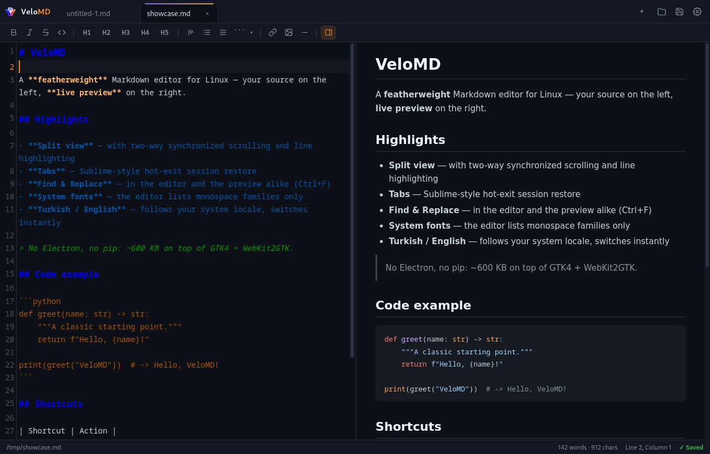
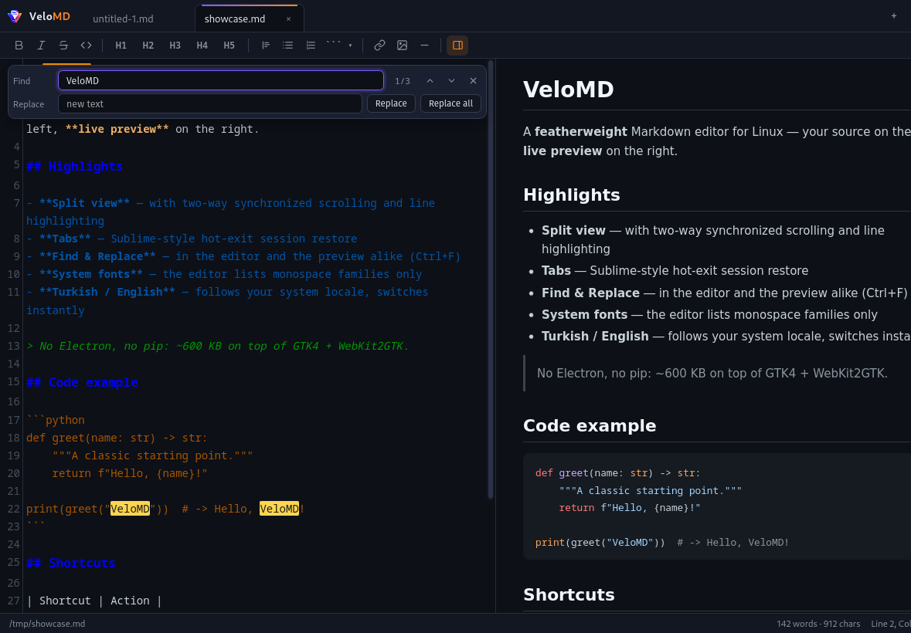
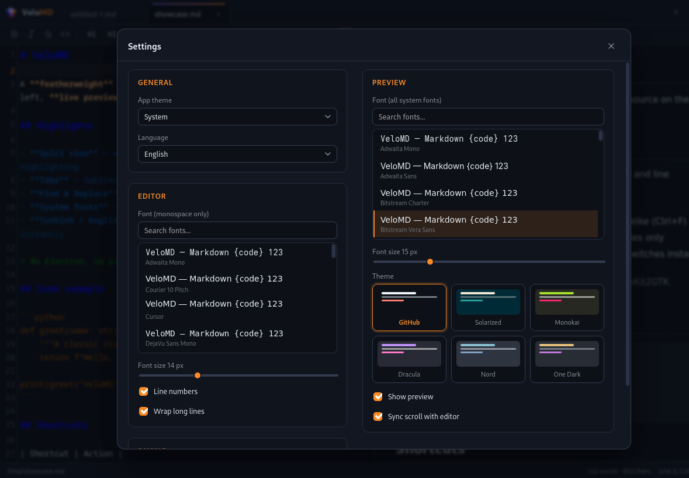

<div align="center">

# VeloMD

**A featherweight Markdown editor for Linux — split-pane live preview, tabs with hot-exit restore, find & replace, bilingual UI.**

[](https://www.python.org/)
[](https://webkitgtk.org/)
[-FCC624?logo=linux&logoColor=black)](#requirements)
[](#what-it-is)
[](LICENSE)

English · [Türkçe](README.tr.md)



</div>

---

## What it is

VeloMD is a desktop Markdown editor built around one screen: your source on the left, the rendered
page on the right. Type, and the preview follows — scroll, and the two panes stay anchored to the
same block; put your cursor on a line and its counterpart lights up in the preview.

It is deliberately small. The whole interface is a single GTK4 + WebKit2GTK window around ~600 KB of
vendored HTML/CSS/JS (CodeMirror, markdown-it, highlight.js) — no Electron, no Node, no pip
dependencies, and it works fully offline.

## Features

**Editing & preview**
- **Split-pane live preview** with a draggable divider (double-click to re-balance; the ratio sticks)
- **Two-way synchronized scrolling** and **current-line highlighting** in the preview, via a
  source-line map
- **Find & Replace** in the editor *(Ctrl+F / Ctrl+Shift+F)* and search in the preview — both
  bilingual, with yellow/orange hit markers and a match counter
- Markdown toolbar: bold/italic/strike/code, headings 1–5, quotes, lists, links, images, and
  **code blocks with a language picker** (Bash, Python, PHP, C, JS, …)
- Word/character/selection counts, line:column, save state in the status bar

**Files & session**
- **Tabs** — middle-click or × to close, dirty indicators, unsaved-changes confirmation
- **Hot-exit session restore** (Sublime-style): reopen finds your open tabs, active tab, window
  geometry, and even unsaved buffer contents waiting for you
- **Autosave** (configurable delay) and a file dialog that remembers your last folder

**Appearance**
- **App theme: Light / Dark / System** — the whole UI follows, and the *GitHub* and *Solarized*
  preview themes switch to their light/dark variant automatically; live-follows the desktop theme
- Six preview themes: GitHub, Solarized, Monokai, Dracula, Nord, One Dark
- **Fonts come from your system**: the editor lists monospace families only (`fc-list :mono`),
  the preview lists everything — searchable, live-previewed
- **Turkish and English**, following your system locale, switchable instantly

<div align="center">

 

</div>

## Requirements

| | |
|---|---|
| **OS** | Linux (X11 or Wayland) |
| **Python** | 3.8 or newer |
| **Runtime** | PyGObject + GTK4 & WebKit2GTK 6.0 (falls back to GTK3 & WebKit 4.1) — present on most desktops, installed automatically when missing |
| **Fonts** | fontconfig (`fc-list`) for the system font lists |

## Installation

```bash
git clone https://github.com/tkinali/VeloMD.git
cd VeloMD
./install.sh
```

The installer checks the dependencies and installs them through your package manager if needed
(dnf / apt / pacman / zypper / apk), puts a `velomd` command in `~/.local/bin`, and registers the
application-menu entry with the icon. The installer itself is **English by default** and switches to
Turkish on a Turkish system; force either with `./install.sh --lang=en` / `--lang=tr`.

Remove every trace again (command, menu entry, icon, settings) with:

```bash
./install.sh --uninstall
```

Manual dependency names per distribution are listed in [README.tr.md](README.tr.md) and below:

| Distribution | Packages |
|--------------|----------|
| Fedora | `sudo dnf install python3-gobject gtk4 webkitgtk6.0 fontconfig` |
| Ubuntu ≥ 24.10 / Debian ≥ 13 | `sudo apt install python3-gi gir1.2-gtk-4.0 gir1.2-webkit-6.0 fontconfig` |
| Ubuntu 22.04–24.04 LTS | `sudo apt install python3-gi gir1.2-gtk-3.0 gir1.2-webkit2-4.1 fontconfig` |
| Arch | `sudo pacman -S python-gobject gtk4 webkit2gtk-5.0 fontconfig` |
| openSUSE | `sudo zypper install python3-gobject typelib-1_0-Gtk-4_0 typelib-1_0-WebKit-6_0 fontconfig` |

On distributions whose repos carry only WebKit 4.1, install those packages instead — VeloMD
automatically runs in its GTK3 mode.

### Prebuilt packages

The [Releases page](https://github.com/tkinali/VeloMD/releases) carries an RPM, a DEB and an
AppImage for each version:

| Package | Install |
|---------|---------|
| `velomd-<ver>.rpm` | Fedora: `sudo dnf install velomd-*.rpm` |
| `velomd_<ver>_all.deb` | Debian/Ubuntu/Mint: `sudo apt install velomd_*_all.deb` |
| `VeloMD-<ver>.x86_64.AppImage` | Any distro: `chmod +x` and run — uses your system's GTK/WebKit |

The packages only contain VeloMD itself (~1 MB, architecture-independent); GTK, WebKit and
fontconfig come from your distribution's repositories automatically. Tagging a version
(`git tag v1.0.0 && git push --tags`) makes the CI build and publish all three.

## Usage

Start it from your application menu, run `velomd`, or open a file directly:

```bash
velomd NOTES.md
```

### Keyboard shortcuts

| Shortcut | Action |
|----------|--------|
| `Ctrl+O` / `Ctrl+S` / `Ctrl+Shift+S` | Open / save / save as |
| `Ctrl+T` / `Ctrl+W` | New tab / close tab |
| `Ctrl+F` / `F3` | Search (editor when focused, preview otherwise) / next hit |
| `Ctrl+Shift+F` | Find & replace bar (editor) |
| `Tab` in the search bar | Move from Find to Replace |
| `Enter` / `Ctrl+Enter` in Replace | Replace active hit / replace all |
| `Ctrl+B` / `Ctrl+I` / `Ctrl+K` | Bold / italic / link |
| `Ctrl+=` / `Ctrl+-` / `Ctrl+0` | Font size ± / reset |
| `Ctrl+,` | Settings |

### Settings

Everything lives in `~/.config/velomd/settings.json`: fonts and sizes, preview theme, app theme
(light/dark/system), language (system/tr/en), line numbers, word wrap, sync scrolling, autosave and
its delay, split ratio, window geometry. The session (`session.json`) sits next to it.

## Project layout

```
VeloMD/
├── main.py                    GTK4 + WebKit shell, JS bridge, file I/O, dialogs
├── app/
│   ├── index.html             interface skeleton
│   ├── css/app.css            dark/light UI theme + CodeMirror colors
│   ├── css/preview-themes/    six preview themes
│   ├── js/                    bridge, i18n, settings, preview, editor,
│   │                          edsearch, pvsearch, sync, tabs, app
│   └── vendor/                CodeMirror 5, markdown-it, highlight.js (offline)
├── install.sh                 installer / uninstaller
└── docs/                      screenshots + GitHub Pages page
```

## Contributing

Issues and pull requests are welcome. The interface is plain HTML/CSS/JS and the shell is a single
Python file — both are meant to be hackable.

## License

MIT — see [LICENSE](LICENSE).
