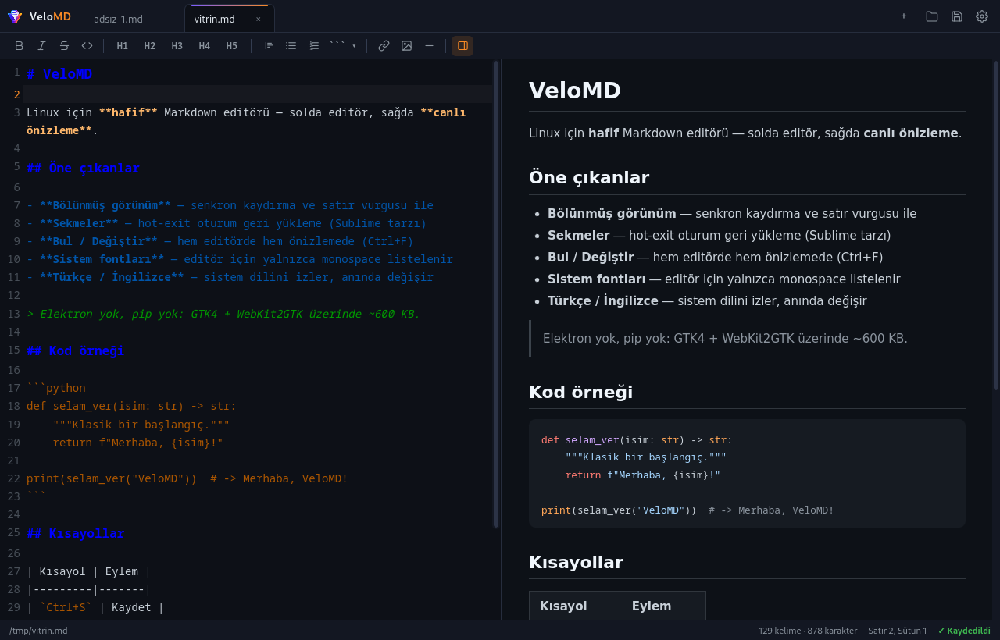
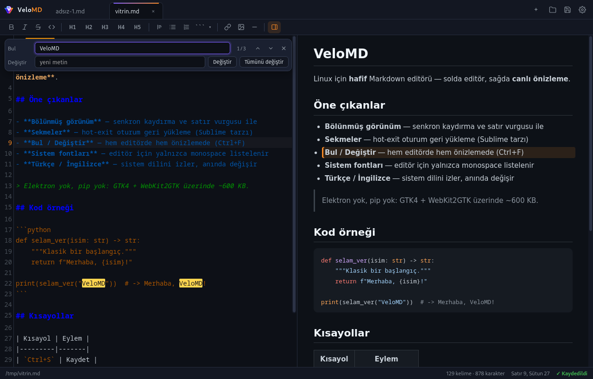
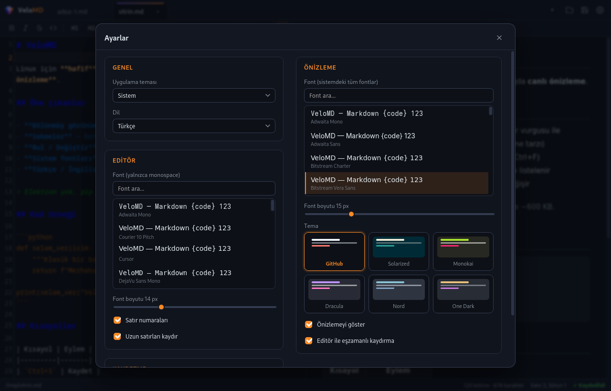

<div align="center">

# VeloMD

**Linux için hafif Markdown editörü — bölünmüş canlı önizleme, hot-exit'li sekmeler, bul/değiştir, iki dilli arayüz.**

[](https://www.python.org/)
[](https://webkitgtk.org/)
[-FCC624?logo=linux&logoColor=black)](#gereksinimler)
[](#nedir)
[](LICENSE)

[Türkçe](README.tr.md) · [English](README.md)



</div>

---

## Nedir?

VeloMD tek bir ekran etrafında kurulmuş bir masaüstü Markdown editörü: solda kaynağınız, sağda
render edilmiş sayfa. Siz yazarken önizleme izler; kaydırdığınızda iki bölme aynı bloğa hizalı
kalır, imleci bir satıra götürdüğünüzde karşılığı önizlemede aydınlanır.

Bilinçli olarak küçüktür. Arayüzün tamamı, ~600 KB'lık yerleştirilmiş (vendored) HTML/CSS/JS
(CodeMirror, markdown-it, highlight.js) etrafında tek bir GTK4 + WebKit2GTK penceresidir —
Electron yok, Node yok, pip bağımlılığı yok ve tamamen çevrimdışı çalışır. Tasarım gereği
Linux-native'dır: bu yığın onu bu kadar küçük tutan şeydir; Windows veya macOS sürümü yoktur.

## Özellikler

**Düzenleme ve önizleme**
- **Bölünmüş canlı önizleme** — sürüklenebilir ayırıcı (çift tık: eşit böl; oran hatırlanır)
- **Çift yönlü senkron kaydırma** ve kaynak satır haritasıyla **imleç satırının vurgulanması**
- Editörde **bul/değiştir** *(Ctrl+F / Ctrl+Shift+F)*, önizlemede arama — ikisi de iki dilli,
  sarı/turuncu eşleşme işaretleri ve sayaçla
- Markdown araç çubuğu: kalın/italik/üstü çizili/kod, 1–5 başlıklar, alıntı, listeler, bağlantı,
  resim ve **dil seçimli kod bloğu** (Bash, Python, PHP, C, JS, …)
- Durum çubuğunda kelime/karakter/seçim sayısı, satır:sütun, kaydetme durumu

**Dosyalar ve oturum**
- **Sekmeler** — orta tık veya × ile kapatma, dirty göstergesi, kaydedilmemiş değişiklik onayı
- **Hot-exit oturum geri yükleme** (Sublime tarzı): yeniden açtığınızda sekmelerinizi, aktif
  sekmeyi, pencere boyutunu ve hatta kaydedilmemiş arabellek içeriğinizi bulursunuz
- **Otomatik kaydetme** (gecikme ayarlanabilir) ve son klasörü hatırlayan dosya penceresi

**Görünüm**
- **Uygulama teması: Açık / Koyu / Sistem** — tüm arayüz uyar; *GitHub* ve *Solarized* önizleme
  temaları otomatik olarak açık/koyu varyantına geçer, masaüstü temasını canlı izler
- Altı önizleme teması: GitHub, Solarized, Monokai, Dracula, Nord, One Dark
- **Fontlar sisteminizden gelir**: editör yalnızca monospace aileleri listeler (`fc-list :mono`),
  önizleme hepsini listeler — aranabilir, canlı önizlemeli
- **Türkçe ve İngilizce**, sistem dilini izler, anında değiştirilebilir

<div align="center">

 

</div>

## Gereksinimler

| | |
|---|---|
| **İşletim sistemi** | Linux (X11 veya Wayland) |
| **Python** | 3.8 veya üzeri |
| **Çalışma zamanı** | PyGObject + GTK4 & WebKit2GTK 6.0 (yoksa GTK3 & WebKit 4.1'e düşer) — çoğu masaüstünde hazırdır, eksikse otomatik kurulur |
| **Fontlar** | Sistem font listeleri için fontconfig (`fc-list`) |

## Kurulum

```bash
git clone https://github.com/tkinali/VeloMD.git
cd VeloMD
./install.sh
```

Kurulum betiği bağımlılıkları denetler ve eksikse dağıtımın paket yöneticisiyle kurar
(dnf / apt / pacman / zypper / apk), `velomd` komutunu `~/.local/bin` içine yerleştirir ve
uygulama menüsü girdisini ikonla kaydeder. Betiğin arayüzü **varsayılan olarak İngilizcedir**;
sistem dili Türkçe olduğunda Türkçe gösterir. Dili sabitlemek için:
`./install.sh --lang=tr` ya da `--lang=en`.

Her şeyi (komut, menü girdisi, ikon, ayarlar) iz bırakmadan kaldırmak için:

```bash
./install.sh --uninstall
```

Dağıtıma göre paket adları:

| Dağıtım | Paketler |
|---------|----------|
| Fedora | `sudo dnf install python3-gobject gtk4 webkitgtk6.0 fontconfig` |
| Ubuntu ≥ 24.10 / Debian ≥ 13 | `sudo apt install python3-gi gir1.2-gtk-4.0 gir1.2-webkit-6.0 fontconfig` |
| Ubuntu 22.04–24.04 LTS | `sudo apt install python3-gi gir1.2-gtk-3.0 gir1.2-webkit2-4.1 fontconfig` |
| Arch | `sudo pacman -S python-gobject gtk4 webkit2gtk-5.0 fontconfig` |
| openSUSE | `sudo zypper install python3-gobject typelib-1_0-Gtk-4_0 typelib-1_0-WebKit-6_0 fontconfig` |

Deposunda yalnızca WebKit 4.1 olan dağıtımlarda o paketleri kurun — VeloMD otomatik olarak
GTK3 kipine geçer.

### Hazır paketler

[Releases sayfasında](https://github.com/tkinali/VeloMD/releases) her sürüm için bir RPM,
bir DEB ve bir AppImage bulunur:

| Paket | Kurulum |
|-------|---------|
| `velomd-<sürüm>.rpm` | Fedora: `sudo dnf install velomd-*.rpm` |
| `velomd_<sürüm>_all.deb` | Debian/Ubuntu/Mint: `sudo apt install velomd_*_all.deb` |
| `VeloMD-<sürüm>.x86_64.AppImage` | Her dağıtım: `chmod +x` ile çalıştır — GTK/WebKit'i sistemin kullanır |

Paketlar yalnızca VeloMD'nin kendisini içerir (~1 MB, mimariden bağımsız); GTK, WebKit ve
fontconfig dağıtımının deposundan otomatik gelir. Bir sürüm etiketlemek
(`git tag v1.0.0 && git push --tags`) CI'nın üçünü de derleyip yayınlamasını sağlar.

## Kullanım

Uygulama menüsünden başlatın, `velomd` komutunu çalıştırın ya da dosyayı doğrudan açın:

```bash
velomd NOTLAR.md
```

### Klavye kısayolları

| Kısayol | Eylem |
|---------|-------|
| `Ctrl+O` / `Ctrl+S` / `Ctrl+Shift+S` | Aç / kaydet / farklı kaydet |
| `Ctrl+T` / `Ctrl+W` | Yeni sekme / sekmeyi kapat |
| `Ctrl+F` / `F3` | Ara (odak editördeyse editörde, değilse önizlemede) / sonraki |
| `Ctrl+Shift+F` | Bul/değiştir çubuğu (editör) |
| `Tab` (arama çubuğunda) | Bul alanından Değiştir alanına geç |
| `Enter` / `Ctrl+Enter` (değiştirmede) | Aktif eşleşmeyi / tümünü değiştir |
| `Ctrl+B` / `Ctrl+I` / `Ctrl+K` | Kalın / italik / bağlantı |
| `Ctrl+=` / `Ctrl+-` / `Ctrl+0` | Font boyutu ± / sıfırla |
| `Ctrl+,` | Ayarlar |

### Ayarlar

Her şey `~/.config/velomd/settings.json` içinde: fontlar ve boyutlar, önizleme teması, uygulama
teması (açık/koyu/sistem), dil (sistem/tr/en), satır numaraları, satır kaydırma, eşzamanlı
kaydırma, otomatik kaydetme ve gecikmesi, bölme oranı, pencere boyutu. Oturum (`session.json`)
yanında durur.

## Proje düzeni

```
VeloMD/
├── main.py                    GTK4 + WebKit kabuğu, JS köprüsü, dosya I/O, pencereler
├── app/
│   ├── index.html             arayüz iskeleti
│   ├── css/app.css            koyu/açık UI teması + CodeMirror renkleri
│   ├── css/preview-themes/    altı önizleme teması
│   ├── js/                    bridge, i18n, settings, preview, editor,
│   │                          edsearch, pvsearch, sync, tabs, app
│   └── vendor/                CodeMirror 5, markdown-it, highlight.js (çevrimdışı)
├── install.sh                 kurulum / kaldırma
└── docs/                      ekran görüntüleri + GitHub Pages sayfası
```

## Katkı

Sorun bildirimleri ve katkı pull request'leri memnuniyetle karşılanır. Arayüz düz HTML/CSS/JS,
kabuk tek bir Python dosyası — ikisi de üzerinde çalışmaya davet eder.

## Lisans

MIT — bkz. [LICENSE](LICENSE).
